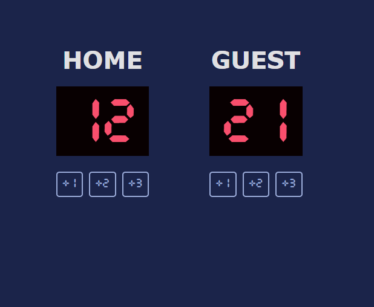

# 🏀 Basketball Scoreboard

A simple **Basketball Scoreboard** built using **HTML**, **CSS**, and **JavaScript**.
This project displays the scores for two teams — **Home** and **Guest** — with buttons to add +1, +2, or +3 points.

## ✅ Features

- Display scores for Home and Guest teams.
- Buttons to increase the score by:
  - +1 point
  - +2 points
  - +3 points
- Real-time score updates.
- Clean, readable scoreboard layout.

## 🧩 Technologies Used

- HTML5 – Structure of the page
- CSS3 – Styling and layout
- JavaScript – Logic for handling score updates and button interactions

## 📁 Project Structure

```bash
/project-folder
│── index.html # Main HTML structure
│── index.css # Stylesheet for the scoreboard
└── index.js # JavaScript logic for score control
```

## 🚀 How to Run

1. Clone this repository:
   `git clone <repository-url>`
2. Open the index.html file in your browser.
3. The scoreboard is ready to use!

## 🎯 Purpose of the Project

This project is designed for beginners learning:

- DOM manipulation
- Event handling
- Basic JavaScript logic
- Organizing frontend project files

## 📸 Preview


