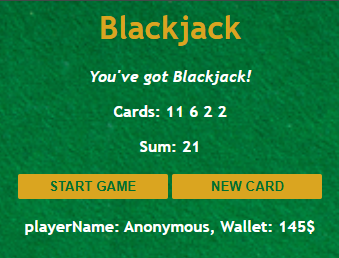

# 🃏 Blackjack Game

A simple web-based Blackjack game built with **HTML**, **CSS**, and **vanilla JavaScript**.

## 🚀 Features

- 🎮 Start the game with two random cards
- 🧮 Display current cards and total sum
- 🃠 Draw new cards until you win (Blackjack) or lose

## 🧱 Project Structure

```bash
.
├── index.html        # Main webpage structure
├── assets/
│   ├── index.css     # Styling for the game interface
│   ├── index.js      # Core game logic
│   └── image/
│       └── table.png # Background image for the Blackjack table
```

## 🕹️ How to Play

1. Open index.html in your browser.
2. Click START GAME to begin.
3. You’ll be dealt two random cards.
4. Based on your total:

- ≤ 20: You can draw another card.
- = 21: You win — Blackjack!
  - 21: You lose — You're out of the game!

5. Click NEW CARD to draw another card (if allowed).

## 📸 Example Output


